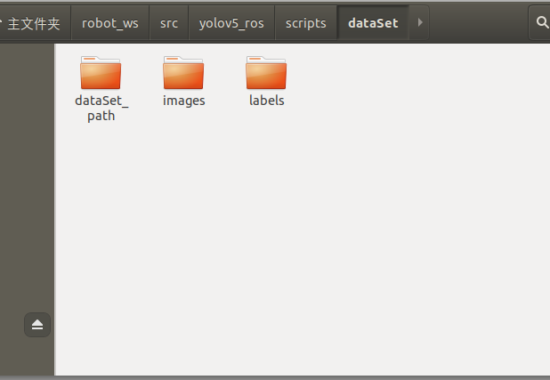
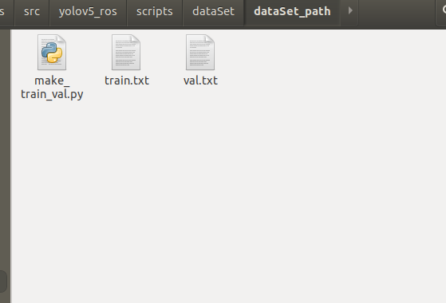
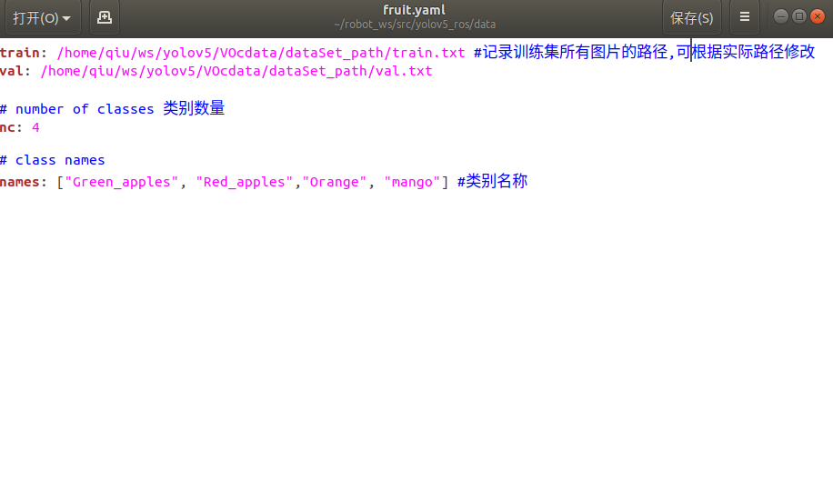

## 程序启动步骤

1. 水果识别：  (yolov5_ros/scripts/detect_fruit.py)      
```bash
        roslaunch yolov5_ros yolov5_fruit.launch    # 启动摄像头
        rostopic list    #查找当前话题
         # 输入指令，1：识别Red_apples  ; 2：识别Green_apple ; 3：识别Orange  ; 4 ：识别mango
        rostopic pub -1 /yolov5_test std_msgs/Int64 "data: 3"   
```

2. 医疗废弃物识别：(yolov5_ros/scripts/detect_medical.py)    
```bash
roslaunch yolov5_ros yolov5_medical.launch
```

3. 电器柜识别：(yolov5_ros/scripts/detect_dqg.py)  
```bash
roslaunch usb_cam usb_cam-test.launch
rostopic list      #修改yolov5_dqg.launch文件的 'image_topic'话题名
roslaunch yolov5_ros yolov5_dqg.launch 
```

***
## 环境配置 

1. Install  (install requirements.txt in a _Python>=3.7.0_ environment, including _PyTorch>=1.7_.)
```bash
cd yolov5_ros
sudo pip install -r requirements.txt  # install
```

2. 国内常用下载源  
```bash
# 清华
https://pypi.tuna.tsinghua.edu.cn/simple  
# 阿里云
https://mirrors.aliyun.com/pypi/simple/  
# 中国科技大学
https://pypi.mirrors.ustc.edu.cn/simple/ 
# 华中理工大学
https://pypi.hustunique.com/  
# 山东理工大学
https://pypi.sdutlinux.org/  
# 豆瓣
https://pypi.douban.com/simple/   
```

***
##  Training (以水果训练为例)
1. __准备数据集：__<code> yolov5_ros/scripts/ </code>下新建文件夹dataSet，dataSet下分别为<code>images、labels、dataSet_path   </code>  
```bash
|--dataset  
    |--images  #存放图像  
    |--labels  #存放标签  
    |--dataSet_path #存放划分训练集和测试集路径的 .txt 文件
```

<p align="left"></p>

2. __用labellmg标注数据集：__ 使用<code>labellmg</code>标注图片，yolo格式保存为.txt文件  
labelImg下载地址：  
```bash
        git clone https://github.com/heartexlabs/labelImg.git
```

<p align="left"></p>

3. __划分训练集、测试集：__  进入<code>yolov5_ros/scripts/dataset/dataSet_path/</code> 目录下打开终端，执行以下命令，得到 <code>train.txt</code> 、<code>val.txt</code>
```bash
        python nake_train_val.py '/home/qiu/robot_ws/src/yolov5_ros/scripts/dataSet/labels' '/home/qiu/robot_ws/src/yolov5_ros/scripts/dataSet/images'     
        #  python nake_train_val.py 'images数据集路径' 'labels标签路径'
```

<p align="left"></p>

4. __新建.yaml：__ <code>fruit.yaml</code>在<code>yolov5_ros/data/</code>路径下

<p align="left"></p>

5. __训练：__  进入<code>yolov5_ros/scripts/</code>  目录下打开终端，执行以下命令
```bash
        python train.py --weights weights/yolov5s.pt  --cfg models/yolov5s.yaml  --data data/fruit.yaml --epoch 1000 
        # weights：权重文件路径
        #cfg：存储模型结构的配置文件
        #data：存储训练、测试数据的文件
        #epochs：训练次数
```